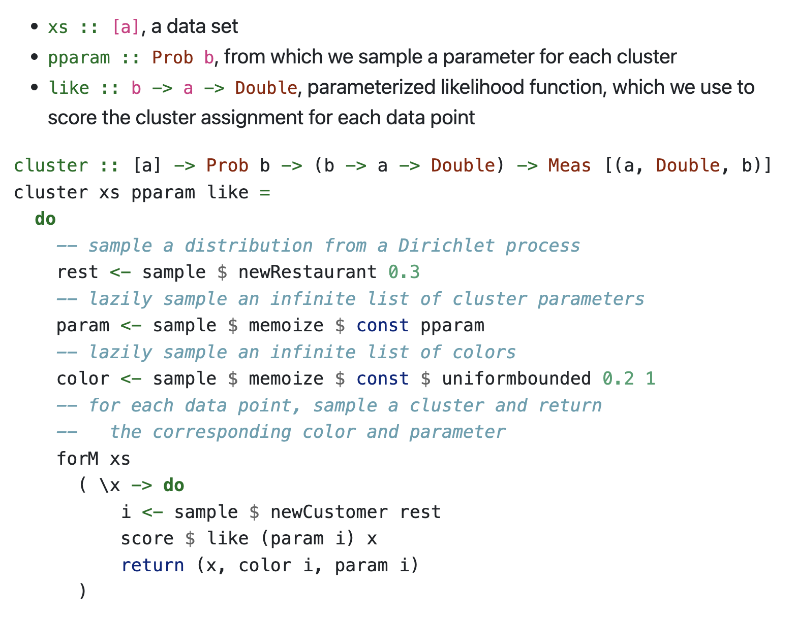
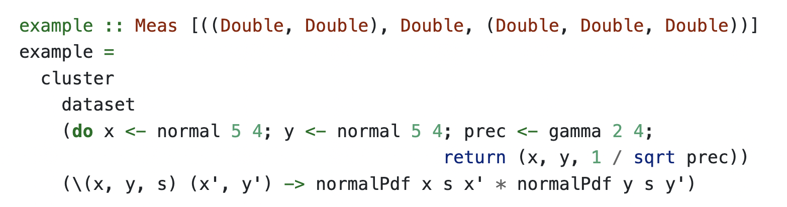
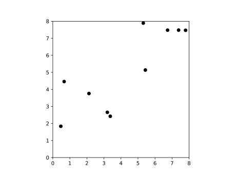
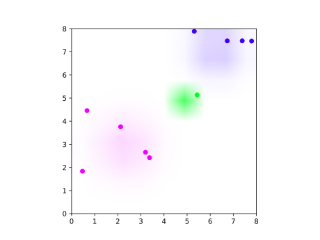

## Clustering Example

## Nominal Sets.

### Support
#### Definition

A set $A \subseteq \mathbb{A}$ is a support for $x \in X$ if $\forall \pi \in \text{Perm } \mathbb{A}, ((\forall a \in A) \pi a = a) \Rightarrow \pi x = x$.

### Nominal Sets
#### Definition

A nominal set is a $\text{Perm } \mathbb{A}$-set such that all of the elements are finitely supported.

#### Definition

These with equivariant actions for the category $\textbf{Nom}$.
